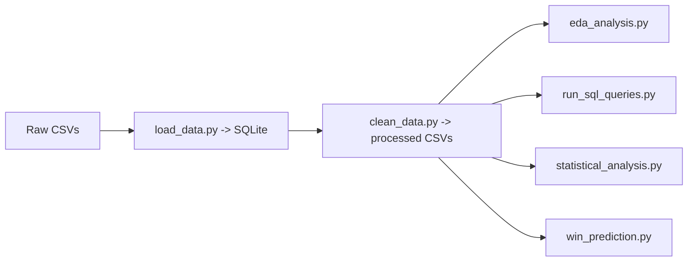

# IPL Cricket Analysis (2008-2019)


Analysis of 12 IPL seasons (2008–2019) — 756 matches, 179,077 ball-by-ball deliveries. The pipeline goes from raw CSVs into SQLite, through cleaning and feature engineering, then branches into EDA, SQL queries, hypothesis tests, and a mid-match win predictor. The notebook covers everything in one walkthrough if you'd rather skip the scripts.

---

## Questions

1. Which teams dominated across the 12 seasons?
2. Who are the standout individual performers in batting and bowling?
3. Does winning the toss materially affect the result?
4. How does run scoring shift between powerplay, middle overs, and death overs?
5. Are first-innings and second-innings totals statistically different?

---

## Key Findings

| Insight | Result |
| --- | --- |
| Most successful team | Mumbai Indians — 109 wins across 12 seasons |
| Top run scorer (career) | Virat Kohli — 5,434 runs |
| Top wicket taker (career) | Lasith Malinga — 188 wickets |
| Toss advantage | Toss winners win ~51% of matches — basically coin flip |
| Death overs scoring | Death overs average ~20% more runs per over than middle overs |
| 1st vs 2nd innings | Mann-Whitney U test shows a significant difference in score distributions |
| Win prediction | Logistic regression at ball 60 of the chase — run `python scripts/win_prediction.py` |

---

## Dashboard


Four panels: phase-by-phase run rates, top 10 career run scorers, toss win % by decision type, and dismissal type breakdown across seasons.

---

## Dataset

| Property | Value |
| --- | --- |
| Source | [Kaggle — IPL Complete Dataset (2008-2019)](https://www.kaggle.com/datasets/patrickb1912/ipl-complete-dataset-20082020) |
| Seasons | 2008–2019 (12 seasons) |
| Matches | 756 |
| Ball-by-ball deliveries | 179,077 |
| Tables | `matches`, `deliveries` |

`matches.csv` — one row per game: date, teams, venue, toss, winner, win margin  
`deliveries.csv` — one row per delivery: batsman, bowler, runs, dismissal type

---

## Project Structure

```
ipl-analysis/
├── assets/
│   └── ipl_dashboard.png
├── data/
│   ├── raw/
│   │   ├── matches.csv
│   │   └── deliveries.csv
│   ├── processed/
│   │   ├── matches_clean.csv
│   │   └── deliveries_clean.csv
│   └── ipl.db
├── notebooks/
│   └── 01_ipl_analysis.ipynb
├── scripts/
│   ├── load_data.py
│   ├── clean_data.py
│   ├── eda_analysis.py
│   ├── run_sql_queries.py
│   ├── statistical_analysis.py
│   └── win_prediction.py
└── requirements.txt
```

---

## Analysis Pipeline



---

## Techniques

### Data Engineering
- Standardised franchise names across seasons (e.g. Delhi Daredevils → Delhi Capitals)
- Removed super overs to avoid scoring distortion
- Tagged each delivery as powerplay (1–6), middle (7–15), or death (16–20)
- Flagged legal deliveries for accurate strike rate and economy calculations

### SQL (`run_sql_queries.py`)
- Window functions (`SUM() OVER (PARTITION BY year)`) for season-level win share
- `HAVING` filters for minimum match thresholds
- Toss-winner vs match-winner join analysis

### Statistical Tests (`statistical_analysis.py`)
- Chi-square: toss decision vs match outcome independence
- Bootstrap CI (10,000 iterations): mean innings score
- Mann-Whitney U: first-innings vs second-innings total distributions

### Win Predictor (`win_prediction.py`)

Snapshot taken at ball 60 (10 overs into the chase):

| Feature | Description |
| --- | --- |
| `runs_so_far` | Runs scored by ball 60 |
| `wickets_lost` | Wickets fallen by ball 60 |
| `runs_required` | Runs still needed |
| `balls_remaining` | Balls left |
| `rrr` | Required run rate |
| `target` | First-innings total |

`LogisticRegression` with `StandardScaler`, 80/20 split.

---

## Setup

```bash
git clone https://github.com/ritscode17/ipl-cricket-analysis.git
cd ipl-cricket-analysis

python -m venv venv
source venv/bin/activate   # macOS/Linux
venv\Scripts\activate      # Windows

pip install -r requirements.txt
```

## How to Run

```bash
python scripts/load_data.py             # Step 1 — load CSVs into SQLite
python scripts/clean_data.py            # Step 2 — clean + feature engineer
python scripts/eda_analysis.py          # Step 3 — EDA dashboard
python scripts/run_sql_queries.py       # Step 4 — SQL analysis
python scripts/statistical_analysis.py  # Step 5 — hypothesis tests
python scripts/win_prediction.py        # Step 6 — win predictor
```

Or open the notebook:

```bash
jupyter notebook notebooks/01_ipl_analysis.ipynb
```

---

## Tech Stack

| Tool | Purpose |
| --- | --- |
| Python 3.11 | Core language |
| Pandas | Data wrangling |
| NumPy | Numerical ops + bootstrap sampling |
| Matplotlib / Seaborn | Static charts and dashboard |
| Plotly | Interactive charts |
| SciPy | Hypothesis tests |
| Scikit-learn | Feature scaling + logistic regression |
| SQLite / SQLAlchemy | Relational storage + SQL querying |
| Jupyter | Notebook walkthrough |

---

## Limitations

- No player-level context (injuries, form, mid-season trades).
- Win predictor uses a fixed ball-60 snapshot, not a ball-by-ball curve.
- Weather and pitch data not available in the dataset.

---

## Future Work

- Ball-by-ball live win probability curves.
- Compare logistic regression against gradient boosting.
- Add venue or season-level features.

---

## Author

**Ritinder Kaur** · [GitHub](https://github.com/ritscode17)

---

## License

MIT
