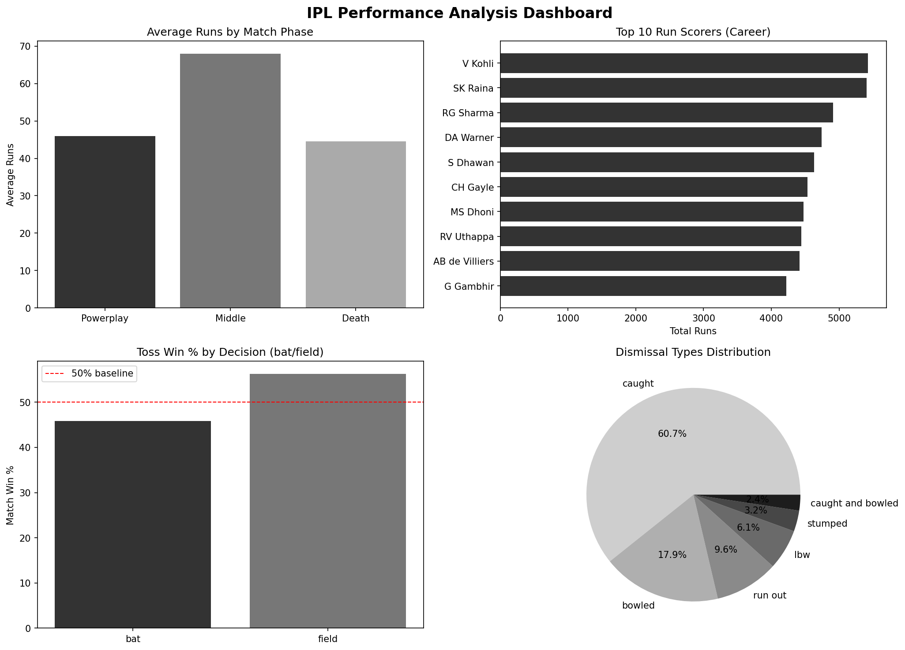
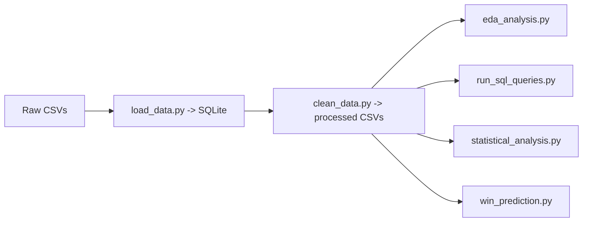

# IPL Cricket Analysis (2008-2019)


End-to-end analysis of 12 IPL seasons (2008-2019) covering 756 matches and 179,077 ball-by-ball deliveries. The project builds a full analytics pipeline: raw CSV ingestion -> SQLite -> cleaned datasets -> EDA dashboard -> SQL and statistical analysis -> win prediction model.

---

## Portfolio Summary

- Built an end-to-end pipeline from raw IPL CSVs to SQLite, cleaned datasets, and a multi-panel dashboard.
- Answered five core performance questions on teams, players, toss decisions, and innings scoring dynamics.
- Used SQL window functions, HAVING filters, and joins to surface season and player insights.
- Applied inferential statistics: chi-square, bootstrap CI, and Mann-Whitney U tests.
- Trained a logistic regression model to predict win probability at the 10-over mark of the chase.
- Delivered reproducible scripts, a notebook walkthrough, and a portfolio-ready dashboard image.

---

## Objectives

1. Which teams dominated across the tournament's history?
2. Who are the standout individual performers in batting and bowling?
3. Does winning the toss materially impact match outcome?
4. How does run scoring vary by match phase (powerplay, middle, death)?
5. Are first-innings and second-innings scores statistically different?

---

## Key Findings

| Insight | Result |
| --- | --- |
| Most successful team | Mumbai Indians - 109 wins across 12 seasons |
| Top run scorer (career) | Virat Kohli - 5,434 runs |
| Top wicket taker (career) | Lasith Malinga - 188 wickets |
| Toss advantage | Teams that win the toss win about 51% of matches (near chance) |
| Death overs scoring | Death overs average about 20% more runs per over than middle overs |
| 1st vs 2nd innings scoring | Mann-Whitney U test shows a significant difference in distributions |
| Win prediction | Logistic regression at ball 60 of the chase; run `python scripts/win_prediction.py` for metrics |

---

## Dashboard



The dashboard captures four core dimensions of IPL performance in a single view:

- Phase-by-phase run scoring (powerplay / middle / death)
- Top 10 career run scorers
- Toss win percentage by decision type (bat vs field) with a 50% baseline
- Dismissal type distribution across seasons

---

## Dataset

| Property | Value |
| --- | --- |
| Source | [Kaggle - IPL Complete Dataset (2008-2019)](https://www.kaggle.com/datasets/patrickb1912/ipl-complete-dataset-20082020) |
| Seasons | IPL 2008 to IPL 2019 (12 seasons) |
| Matches | 756 |
| Ball-by-ball deliveries | 179,077 |
| Tables | `matches`, `deliveries` |

`matches.csv` - one row per game: date, teams, venue, toss, winner, win margin
`deliveries.csv` - one row per delivery: batsman, bowler, runs, dismissal type

---

## Project Structure

```
ipl-analysis/
├── assets/
│   └── ipl_dashboard.png        # Saved dashboard output
├── data/
│   ├── raw/
│   │   ├── matches.csv          # Original match data
│   │   └── deliveries.csv       # Ball-by-ball deliveries
│   ├── processed/
│   │   ├── matches_clean.csv    # Cleaned + feature-engineered matches
│   │   └── deliveries_clean.csv # Cleaned + phase-tagged deliveries
│   └── ipl.db                   # SQLite database for SQL analysis
├── notebooks/
│   └── 01_ipl_analysis.ipynb    # Exploratory analysis with visualisations
├── scripts/
│   ├── load_data.py             # Ingest CSVs -> SQLite
│   ├── clean_data.py            # Clean, standardise, feature-engineer
│   ├── eda_analysis.py          # EDA + 4-panel dashboard
│   ├── run_sql_queries.py       # SQL queries via sqlite3
│   ├── statistical_analysis.py  # Hypothesis tests (chi-square, bootstrap, Mann-Whitney)
│   └── win_prediction.py        # Logistic Regression win predictor
└── requirements.txt
```

---

## Analysis Pipeline



---

## Techniques Used

### Data Engineering

- Standardised franchise names across seasons (example: Delhi Daredevils -> Delhi Capitals)
- Removed super overs to avoid scoring distortion
- Classified each delivery into powerplay (1-6), middle (7-15), death (16-20)
- Flagged legal deliveries for accurate strike rate and economy calculations

### SQL Analysis (`run_sql_queries.py`)

- Window functions (`SUM() OVER (PARTITION BY year)`) for season-level win share
- `HAVING` clauses for minimum match thresholds
- Toss-winner vs match-winner join analysis

### Statistical Analysis (`statistical_analysis.py`)

- Chi-square test for toss decision vs match outcome independence
- Bootstrap confidence interval (10,000 iterations) for mean innings score
- Mann-Whitney U test comparing first-innings vs second-innings totals

### Win Prediction (`win_prediction.py`)

Mid-match prediction using the state at ball 60 (10 overs into the second innings):

| Feature | Description |
| --- | --- |
| `runs_so_far` | Runs scored by ball 60 |
| `wickets_lost` | Wickets fallen by ball 60 |
| `runs_required` | Runs still needed to win |
| `balls_remaining` | Balls left in the innings |
| `rrr` | Required run rate |
| `target` | First-innings total |

Model: `LogisticRegression` with `StandardScaler` and an 80/20 train-test split.

---

## Setup

```bash
# 1. Clone the repo
git clone https://github.com/ritscode17/ipl-cricket-analysis.git
cd ipl-cricket-analysis

# 2. Create and activate a virtual environment
python -m venv venv
source venv/bin/activate        # macOS/Linux
venv\Scripts\activate           # Windows

# 3. Install dependencies
pip install -r requirements.txt
```

---

## How to Run

Run scripts in order from the project root:

```bash
# Step 1 - Load raw data into SQLite
python scripts/load_data.py

# Step 2 - Clean and feature-engineer datasets
python scripts/clean_data.py

# Step 3 - EDA dashboard (saves to assets/ipl_dashboard.png)
python scripts/eda_analysis.py

# Step 4 - SQL analysis
python scripts/run_sql_queries.py

# Step 5 - Hypothesis tests
python scripts/statistical_analysis.py

# Step 6 - Win prediction model
python scripts/win_prediction.py
```

Or open the notebook for a guided walkthrough:

```bash
jupyter notebook notebooks/01_ipl_analysis.ipynb
```

---

## Tech Stack

| Tool | Purpose |
| --- | --- |
| Python 3.11 | Core language |
| Pandas | Data wrangling and aggregation |
| NumPy | Numerical operations and bootstrap sampling |
| Matplotlib / Seaborn | Static visualisations and dashboard |
| Plotly | Interactive charts |
| SciPy | Statistical hypothesis tests |
| Scikit-learn | Feature scaling and logistic regression |
| SQLite / SQLAlchemy | Relational storage and SQL querying |
| Jupyter | Exploratory notebook |

---

## Outputs

- `assets/ipl_dashboard.png` - dashboard for portfolio use
- `data/processed/` - cleaned and feature-engineered datasets
- `data/ipl.db` - SQLite database built from raw CSVs

---

## Limitations

- No player-level context features (injuries, form, team changes) are included.
- The win predictor is trained on a fixed snapshot (ball 60) rather than a full ball-by-ball model.
- Weather and pitch conditions are not available in the dataset.

---

## Future Work

- Add ball-by-ball live win probability curves.
- Compare classical ML models with gradient boosting or calibrated probabilities.
- Enrich the dataset with venue or season-level features.

---

## Author

**Ritinder Kaur** · [GitHub](https://github.com/ritscode17)

---

## License

This project is licensed under the MIT License. See `LICENSE` for details.
